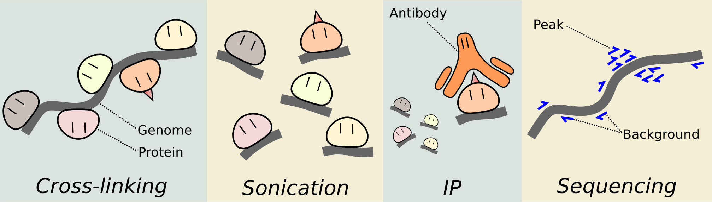

<!--
%\VignetteIndexEntry{Analyzing ChIP-seq data with csaw}
%\VignettePackage{BiocStyle}
%\VignetteEngine{knitr::knitr}
-->

```{r, echo=FALSE, results="hide"}
library(knitr)
opts_chunk$set(error=FALSE)
```

```{r style, echo=FALSE, results='asis'}
BiocStyle::markdown()
```

```{r setup, echo=FALSE}
options(digits=3)
suppressPackageStartupMessages({
  library(csaw)
  library(edgeR)
  library(org.Mm.eg.db)
  library(TxDb.Mmusculus.UCSC.mm10.knownGene)
  library(Gviz)
})
```

# Detecting differential binding in ChIP-seq data with csaw
Package: `r Biocpkg("csaw")` <br />
Author: Aaron Lun (alun@wehi.edu.au) <br />
Compilation date: `r Sys.Date()`

# Motivation

I'll assume that everyone here knows what ChIP-seq is - but if not, then you can look at this cute picture.



Why look for differential binding (DB) between biological conditions?

- The null hypothesis is easy to define, i.e., is binding equal between libraries? No need for a background model or negative controls.
- Results may be more relevant, as DB sites might contribute to biological differences.

Why look for *de novo* sites?

- Minimize assumptions about where the protein binds.
- Discover new things!

Why use windows?

- Because they're simple.
- Improve spatial resolution for complex events.

# Overall workflow

It's a fairly modular process:

1. Counting reads into windows
2. Computing normalization factors
3. Filtering out low-abundance windows
4. Testing for differential binding
5. Aggregating windows into clusters
6. Visualization, annotation and other stuff
 
But before we get into that, we have to set up some data. 
We'll be using the libraries from the [Tiwari et al.'s 2012 study](http://dx.doi.org/10.1038/ng.1036).
This compares binding of the NF-YA transcription factor in embryonic stem cells (ESCs) and terminal neurons (TNs).

```{r}
bam.files <- file.path("/home/ubuntu/data/aaronlun", 
    c("es_1.bam", "es_2.bam", "tn_1.bam", "tn_2.bam"))
```

These are BAM files, so we've already mapped the reads to the *mm10* build of the mouse genome.
For those who are interested, this was done using [subread](http://dx.doi.org/10.1093/nar/gkt214), with some help from SAMtools and Picard.
The full processing pipeline can be found at the location below.

```{r}
system.file("doc", "sra2bam.sh", package="csaw")
```

# Counting reads into windows

The first step is to count reads into windows.
Reads are directionally extended to the average fragment length, to represent the original fragments that were present during immunoprecipitation.
Windows of constant size (10 bp) are tiled across the genome at regular intervals (50 bp).

```{r}
frag.len <- 110
window.width <- 10
spacing <- 50
```

The number of imputed fragments overlapping each window is then counted in each library.
We use the `windowCounts` function to do the actual counting.
We filter out low-quality alignments (mapping quality score less than 50) and we ignore everything except the standard chromosome set.

```{r}
param <- readParam(minq=50, restrict=paste0('chr', c(1:19, 'X', 'Y')))
data <- windowCounts(bam.files, ext=frag.len, width=window.width, spacing=spacing, param=param)
data
```

This gives us a `RangedSummarizedExperiment` object that we can play around with.
Check out `rowRanges(data)`, for the genomic coordinates of the windows; `assay(data)`, for the counts for each window; and `colData(data)`, for library-specific information.

## Interesting questions

- How do we pick the window size?
- What are [cross-correlation plots](http://dx.doi.org/10.1038/nbt.1508), and how do we use them to figure out the extension length? 
```{r}
max.delay <- 500
dedup.on <- readParam(dedup=TRUE, minq=50)
x <- correlateReads(bam.files, max.delay, param=dedup.on)
plot(0:max.delay, x, type="l", ylab="CCF", xlab="Delay (bp)")
```

## Advanced usage

A number of useful read extraction parameters can be specified within the `readParam` object.
These options allow us to:

- set a minimum mapping quality score, to remove spurious alignments.
- remove previously-marked duplicates (i.e., those alignments where 0x400 is set).
- discard alignments in blacklisted regions, e.g., annotated repeats.
- restrict read counting to a subset of chromosomes.
- perform strand-specific read extraction and counting - see `strandedCounts`.
- extract read pairs as explicit fragments for paired-end data.

The idea is to define a single `readParam` object for use throughout the analysis, to ensure the same reads are being extracted each time (with some exceptions, e.g., `correlateReads`).
For example, look at the one that we previously constructed.

```{r}
param
```

# Computing normalization factors

There's several different normalization options in `r Biocpkg("csaw")`, but we'll just focus on removing composition bias.
This is introduced when DB regions take up a bigger slice of the sequencing pie in one library, suppressing the coverage of everything else (e.g., non-DB sites, background regions).
We don't want to detect differences due to this suppression, so we normalize based on the assumption that most of the genome is non-DB background.
First, we count reads into large 10 kbp bins to quantify the coverage of the background regions.

```{r}
binned <- windowCounts(bam.files, bin=TRUE, width=10000, param=param)
```

Any systematic difference between libraries across these background bins must be artifactual and should be eliminated by scaling normalization.
The `normalize` function is a S4 method that wraps the `normalizeCounts` function, which in turn wraps the `calcNormFactors` function from the `r Biocpkg("edgeR")` package.
The actual normalization is performed using the [trimmed mean of M-values (TMM) method](http://dx.doi.org/10.1186/gb-2010-11-3-r25).

```{r}
normfacs <- normalize(binned)
normfacs
```

We can have a look at these factors on MA plots. 
The code below compares the binned counts for libraries 1 and 2, i.e., the two ES replicates.
Note the big blob, which corresponds mostly to the background regions of the genome.
The location of the red line represents the log-scaling factor used to normalize one library against the other.

```{r}
adj.counts <- cpm(asDGEList(binned), log=TRUE)
cur.x <- adj.counts[,1]
cur.y <- adj.counts[,2]
smoothScatter(x=(cur.x+cur.y)/2+6*log2(10), y=cur.x-cur.y,
  xlab="A", ylab="M", main="1 vs 2")
all.dist <- diff(log2(normfacs[c(2, 1)]))
abline(h=all.dist, col="red")
```

## Interesting questions

- Why do we use bins instead of windows?
- Does the bin size affect the normalization factor estimates?

## Advanced usage

Another source of bias comes from differences in immunoprecipitation efficiency between libraries.
If such differences are present, we wouldn't want to detect them because they're not biologically interesting.
Thus, we can normalize by eliminating any systematic difference in abundance across high-abundance windows (i.e., bound sites).
This involves filtering (see next section) and normalizing on the remainders.

```{r}
keep <- aveLogCPM(asDGEList(data)) > -1
normalize(data[keep,])
```

**Note:** we can only pick one set of normalization factors - either to remove composition bias, or to remove efficiency bias.
The choice depends on the biological context of the experiment.
Specifically, do you expect wholesale changes in binding between conditions?

- if not, then systematic changes at binding sites are likely to be artifactual and should be removed as efficiency bias.
- if yes, then systematic changes are likely to be genuine and should not be removed (i.e., normalize for composition bias).

In this case, we'll go for composition bias, as there's no reason that NF-YA binding should be constant between cell types.

Trended biases may also be observed as trends in the MA plots.
These cannot be eliminated by scaling methods like TMM, but require the use of non-linear methods instead.
In `r Biocpkg("csaw")`, this can be achieved by setting `type="loess"` in the call to `normalize`.
This performs loess-based normalization to remove the trend, and produces an offset matrix for use in later model fitting.

# Filtering away low-abundance windows

Filtering is done using the average abundance of each window, as computed using `aveLogCPM` in `r Biocpkg("edgeR")`.
This can be interpreted as the log-(average count)-per-million for each window.
In our statistical model, the average abundance is roughly independent of the DB status of each window, so we avoid data snooping when we select for high-abundance windows.

```{r}
abundance <- aveLogCPM(asDGEList(data))
```

We then keep the windows that are considered to be high-abundance, according to some threshold.
The `RangedSummarizedExperiment` object can be easily subsetted to achieve this (we'll hold onto the original, just in case).

```{r}
keep <- abundance > -1
original <- data
data <- data[keep,]
nrow(data)
```

A very large number of low-abundance windows is problematic as they will mess up some of `r Biocpkg("edgeR")`'s statistical methods and assumptions.
Filtering gets rid of most of these windows and their associated problems, while also reducing computational work and the severity of the multiple testing correction.

## Interesting questions

- Is there a less arbitrary way of choosing the filter threshold?
```{r}
binned.2 <- windowCounts(bam.files, bin=TRUE, width=2000, param=param)
filter.stat.bg <- filterWindows(original, background=binned.2, type="global")
background.keep <- filter.stat.bg$filter > log2(3)
summary(background.keep)
```

## Advanced usage

We can mimic peak callers like [MACS](http://dx.doi.org/10.1186/gb-2008-9-9-r137), where the background is estimated locally for each window.
In this example, we define the local background as the 2 kbp interval around each window.

```{r}
surrounds <- 2000
neighbour <- suppressWarnings(resize(rowRanges(original), surrounds, fix="center"))
wider <- regionCounts(bam.files, regions=neighbour, ext=frag.len, param=param)
```

We then use the `filterWindows` function to process these into enrichment values, for each window over its local background.
We keep those windows that have a 3-fold or higher increase in abundance over its neighbours.

```{r}
filter.stat.loc <- filterWindows(original, wider, type="local")
local.keep <- filter.stat.loc$filter > log2(3)
summary(local.keep)
```

# Testing for differential binding

We first define the experimental design.
This is fairly easy for our set-up, which contains two groups of two biological replicates.
More complex designs can also be accommodated.

```{r}
grouping <- factor(c('es', 'es', 'tn', 'tn'))
design <- model.matrix(~0 + grouping)
colnames(design) <- levels(grouping)
```

We use the [negative binomial (NB) framework](http://dx.doi.org/10.1093/nar/gks042) in the `r Biocpkg("edgeR")` package.
This accounts for low, discrete counts that exhibit overdispersion between biological replicates.
Specifically, variability between replicates is modelled using the NB dispersion parameter, as estimated through the `estimateDisp` function.

```{r}
y <- asDGEList(data, norm.factors=normfacs)
y <- estimateDisp(y, design)
```

We can augment this model with [quasi-likelihood (QL) methods](http://dx.doi.org/10.1515/1544-6115.1826).
The QL dispersions account for window-specific variability, while the NB dispersions model biological variability between replicates.
We fit a generalized linear model (GLM) to the counts for each window, where the QL dispersion for that window is estimated from the GLM deviance.

```{r}
fit <- glmQLFit(y, design, robust=TRUE)
```

Finally, we wrap things up by using the QL F-test to test for DB between our two cell types.

```{r}
contrast <- makeContrasts(es - tn, levels=design)
results <- glmQLFTest(fit, contrast=contrast)
```

## Interesting questions

- What do we do when we don't have any replicates (*caution required*)?
```{r}
norep.fit <- glmFit(y, design, dispersion=0.05)
norep.results <- glmLRT(norep.fit, contrast=contrast)
```
- Why do we need to set `robust=TRUE`?
- How can we get an overall summary of our data set?
```{r}
bin.adjc <- cpm(asDGEList(binned.2), log=TRUE)
plotMDS(bin.adjc, labels=grouping)
```

## Advanced usage

This isn't really that advanced, but we can plot the NB dispersions with the `plotBCV` command.
In the QL framework, we focus on the trend as only the trended NB dispersions will be used later.
We usually see a decreasing trend with abundance, possibly plateauing off at very large abundances.

```{r}
plotBCV(y)
```

Similarly, for the QL dispersions, we can use the `plotQLDisp` function.
This shows the effect of empirical Bayes shrinkage on the estimates, when the raw values are squeezed towards the trend.
We use the shrunken estimates for all downstream processing.
The idea is to reduce uncertainty in the presence of limited replicates, to improve detection power for DB testing.

```{r}
plotQLDisp(fit)
```

If you have more complicated experiments (e.g., multiple groups, blocking factors), you might have to think more carefully about the design matrix and the contrasts.
Check out the `r Biocpkg("edgeR")` user's guide for how to deal with them.

# Aggregating windows into clusters

To correct for multiple testing across thousands of windows, we can think about controlling the false discovery rate (FDR).
However, controlling the FDR across all windows isn't that useful, as few people would interpret ChIP-seq results in terms of windows.
Instead, we want to control the FDR across all genomic regions, i.e., the [region-level FDR](http://dx.doi.org/10.1093/nar/gku351).

To do that, we can cluster adjacent windows into genomic regions using the `mergeWindows` function.
Windows that are less than `tol` apart get thrown into the same cluster.
Merging of adjacent or overlapping windows reduces redundancy and simplifies interpretation of the results.
Each cluster now represents a distinct genomic region.

```{r}
clustered <- mergeWindows(rowRanges(data), tol=1000)
clustered$region
```

We can combine *p*-values for all windows in each cluster using Simes' method.
This computes a single combined *p*-value for each cluster/region, representing the evidence against the global null.
We also get some other statistics, like the total number of windows in each cluster as well as the number that are changing substantially in each direction.

```{r}
tabcom <- combineTests(clustered$id, results$table)
head(tabcom)
```

Each row of the output table corresponds to a cluster/region. 
Controlling the FDR across regions is simple, as we can just apply the Benjamini-Hochberg correction on the combined *p*-values.

## Interesting questions

- What is a sensible value for `tol`? And how do we avoid chaining effects?
```{r}
clustered2 <- mergeWindows(rowRanges(data), tol=100, max.width=5000)
```
- How do we define directionality of the change in each region?
```{r}
tab.best <- getBestTest(clustered$id, results$table)
head(tab.best)
```

## Advanced usage

We can use many different clustering strategies, so long as they are blind to the DB status of the windows. 
One strategy that is particularly useful is to cluster windows according to the promoters in which they are located.
This allows for direct coordination with, say, a differential expression analysis.

```{r}
gene.bodies <- genes(TxDb.Mmusculus.UCSC.mm10.knownGene)
prom <- promoters(gene.bodies, upstream=3000, downstream=1000)
head(prom)
```

We then identify the windows overlapping each promoter.
The set of windows for the promoter of each gene is defined as a cluster.

```{r}
olap <- findOverlaps(prom, rowRanges(data))
olap
```

It's then a simple matter to combine the *p*-values, as we did before.
This is done using a wrapper function that directly accepts a `Hits` object.
We end up with a table, with one row for each entry of `prom`.

```{r}
tabbroad <- combineOverlaps(olap, results$table)
head(tabbroad[!is.na(tabbroad$PValue),])
```

This means we can make a direct statement regarding DB in a promoter region.
Note that the `NA`'s represent those entries of `prom` that have no overlapping windows, and are not shown here because they're not particularly exciting.

# Other stuff

Simple gene-based annotation can be added to the regions using the `detailRanges` function.
This identifies annotated genomic features (exons, promoters, introns) that are overlapped by each region, as well as those flanking each region (plus the gap distance between each flanking feature and the region).

```{r}
anno <- detailRanges(clustered$region, orgdb=org.Mm.eg.db,
  txdb=TxDb.Mmusculus.UCSC.mm10.knownGene)
head(anno$overlap)
```

Some explanation may be in order here. 
Each string represents a comma-separated list, where each entry is of the form `SYMBOL|EXONS|STRAND`, i.e., the symbol of the relevant gene, the exons that are overlapped (`I` for introns, and `0` for promoters) and the strand of the gene.
For flanking regions, an additional `[DISTANCE]` field is present that indicates the distance between the annotated feature and each region. 

```{r}
head(anno$left)
```

We can now put together a table to save to disk, for other people to read and whatnot.
Of course, you can save to other formats if you wish, using packages like `r Biocpkg("rtracklayer")`.

```{r}
all.results <- data.frame(as.data.frame(clustered$region)[,1:3], tabcom, anno)
all.results <- all.results[order(all.results$PValue),]
write.table(all.results, file="saved.tsv", row.names=FALSE, quote=FALSE, sep="\t")
```

Simple visualization can be performed using the `r Biocpkg("Gviz")` package.
We extract reads from the BAM file using the `extractReads` function, and we plot coverage in reads-per-million.
This is done separately for each strand in blue and red.

```{r}
cur.region <- GRanges("chr18", IRanges(77806807, 77807165))
collected <- list()
for (i in 1:length(bam.files)) {
  reads <- extractReads(bam.files[i], cur.region)
  pcov <- as(coverage(reads[strand(reads)=="+"])/data$totals[i]*1e6, "GRanges")
  ncov <- as(coverage(reads[strand(reads)=="-"])/data$totals[i]*1e6, "GRanges")
  ptrack <- DataTrack(pcov, type="histogram", lwd=0, fill=rgb(0,0,1,.4), ylim=c(0,1),
      name=bam.files[i], col.axis="black", col.title="black")
  ntrack <- DataTrack(ncov, type="histogram", lwd=0, fill=rgb(1,0,0,.4), ylim=c(0,1))
  collected[[i]] <- OverlayTrack(trackList=list(ptrack,ntrack))
}
gax <- GenomeAxisTrack(col="black")
plotTracks(c(gax, collected), from=start(cur.region), to=end(cur.region))
```

## Interesting questions

- How do we adjust the annotation parameters?
```{r}
anno2 <- detailRanges(clustered$region, orgdb=org.Mm.eg.db,
  txdb=TxDb.Mmusculus.UCSC.mm10.knownGene, dist=3000, promoter=c(0, 2000))
```
- Do we see strand bimodality in the resulting coverage profiles? What are the top hits that don't exhibit any bimodality?

<!---
First four regions appear to be micro-satellite driven:
chr2    98662201        98667360
chr9    35305151        35305560
chr14   19415651        19419760
chr4    70378051        70378310
-->

## Advanced usage

It may be useful to store the results as a `GRanges` for further manipulation.
This can be done by stuffing the various statistics into the metadata fields.

```{r}
all.regions <- clustered$region
elementMetadata(all.regions) <- tabcom
```

# Final comments

You've just completed a window-based *de novo* analysis of differential binding.
For more information, you can have a look at the `r Biocpkg("csaw")` user's guide, or the documentation for each function.

```{r eval=FALSE}
csawUsersGuide()
```

For bonus points, guess the foodstuff that the proteins are drawn as in the first picture.

